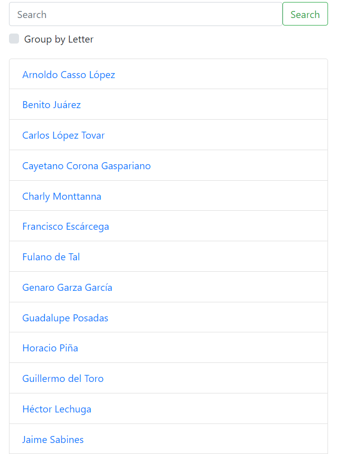
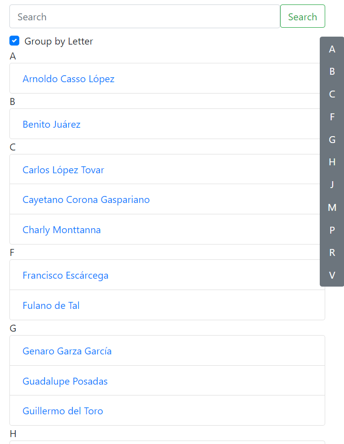
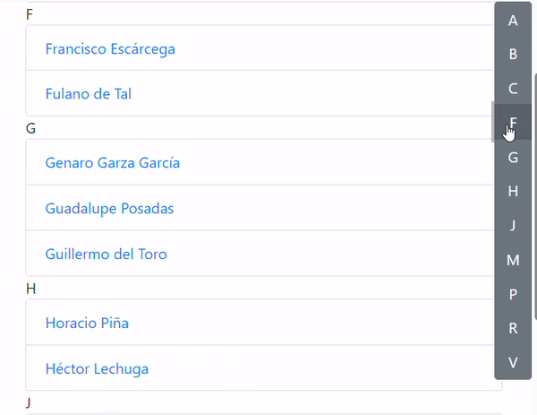
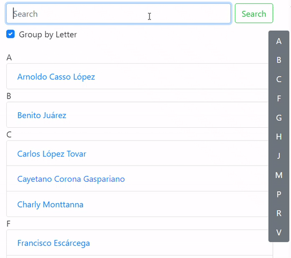

# Ejercicio Final de la Mentoría de JavaScript

Este proyecto tiene como objetivo reforzar los conocimientos adquiridos sobre JavaScript, tratando de implementar lo más nuevo de ECMAScript en el momento que se realice.

### Para ejecutarlo

1. Después de clonar el respositorio con `git clone https://github.com/danysan28/users-list.git`
2. Ejecutar el comando `npm install` para instalar todas las dependencias.
3. Ejecutar el comando `npm run start` para correr el proyecto.
4. Muy posiblemente marque errores, ya que espera la creación de algunas funciones.

# Actividades

1. Analizar el archivo `index.js`, el cual contiene el núcleo de la aplicación y es dónde se utilizarán las funciones que se crearán a lo largo de las siguientes actividades.
2. Implementar la función `loadContacts()`.
   - Esta función debe regresar el contenido del archivo `db.json`.
   - El contenido retornado, debe estar ordenado alfabéticamente por la propiedad `name`.
3. Implementar la función `filterContacts(contacts, query)`
   - Esta función por el momento solo debe retornar la propiedad contacts recibida por parámetos sin aplicarle ningún cambio.
4. Implementar la función `drawContacts(contacts)`.
   - Esta función toma la lista de contactos y será la encargada de dibujar en la UI todos éstos en forma de lista:
     
5. Implementar la función `groupContactsByLetter(contacts)`.
   - Esta función tomará la lista de contactos pasada como parámetro y debe regresar la lista de contactos de la siguiente forma:
     ```
     {
        "A": [/*contactos cuyo nombre comience con la letra A*/],
        "B": [/*contactos cuyo nombre comience con la letra B*/],
     }
     ```
6. Implementar la función `drawGroupedContacts(contacts)`.
   - La función tomará la lista de contactos como parámetro y debe dibujar en la UI la lista de una manera direferente:
       
     _El objetivo es utilizar la función implementada previamente (`groupContactsByLetter(contacts)`)._
7. Implementar función `drawNavigationBar(contacts)`.
   - La función tomará la lista de contactos como parámetro y debe dibujar una barra de navegación que liste las letras de los contactos agrupados y mostrarse del lado derecho verticalmente como se muestra a continuación:  
       
     _El objetivo es utilizar la función implementada previamente (`groupContactsByLetter(contacts)`)._
8. Verificar comportamiento:
   - Cada que el checkbox "Group by Letter" esté activado, la lista deberá desplegarse agrupada y la barra de navegación tiene que ser mostrada.  
     
   - Cada que el checkbox "Group by Letter" esté desactivado, la lista deberá desplegarse sin agruparse.  
     
9. Implementar el siguiente comportamiento de manera libre.  
   
10. Agregar lógica para filtrar contactos en `filterContacts(contacts, query)`. - La función tomará la lista de contactos como parámetro y el criterio de búsqueda ingresado en el input, debe regresar los contactos filtrados cuyo nombre o apellido lleven la variable `query`, si `query` no tiene valor, debe regresar la lista de contactos sin filtrar.
    Por ejemplo:

    ```
    contacts = [{ name: "Pedro Paramo"}, {name:"Juan Camanei"}, {name:"Carlos Castro"}]
    query = "ca"
    result = [{name:"Juan Camanei"}, {name:"Carlos Castro"}]

    contacts = [{ name: "Pedro Paramo"}, {name:"Juan Camanei"}, {name:"Carlos Castro"}]
    query = "p"
    result = [{ name: "Pedro Paramo"}]

    contacts = [{ name: "Pedro Paramo"}, {name:"Juan Camanei"}, {name:"Carlos Castro"}]
    query = "que"
    result = []

    contacts = [{ name: "Pedro Paramo"}, {name:"Juan Camanei"}, {name:"Carlos Castro"}]
    query = ""
    result = [{ name: "Pedro Paramo"}, {name:"Juan Camanei"}, {name:"Carlos Castro"}]
    ```

    
